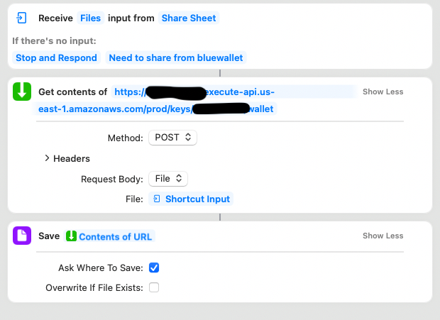

# SigningService (maybe we'll have a more clever name one day!)

## What is this?

This repo has a little "serverless" (runs on lambda and some other services) multisig signing oracle that will sign (or
not) based on _policy_. The idea is that you can have a 2-of-3 multisig wallet in Bluewallet (or another wallet of your
choice, right now we have a parser for bluewallet multisig setup files, so anything that outputs those files -- Sparrow,
some tool you write, you writing it yourself, etc. should work)
where one key is on the phone, one key is kept safely offline (in case you blow away SigningService or whatever), and
then one key is held by SigningService. When you want to spend, your phone makes one signature, and then you send the
PSBT to SigningService, where it will evaluate the request against a configured set of policies, and if it passes, will
sign the PSBT and return it. From there you load the signed PSBT into Bluewallet, hit "finalize" and are ready to
broadcast the transaction! If the transaction violates any of the policies, then the SigningService refuses to sign it.
At that point the money can't be spent without going and digging out the third "recovery" key.

The goal is to (eventually, after the code gets better and the integration isn't a giant kludge) have the convenience
and portability of a phone wallet but have it be secure enough that you can keep access to reasonably large amount of
money without losing sleep over the risk of malware or theft/loss of your phone
("reasonably large amount of money" to me means something like your checking account -- the funds you expect to spend
over a few weeks or a month, and sits between what you'd normally keep as cash in your wallet, and your "savings" which
should be in some offline multisig setup).

## What policies exist so far?

1. ValuePolicy - set a limit on the maximum amount (excluding change) that can be spent in one transaction
2. AndonPolicy - an "andon cord": if you trigger this policy (by setting a boolean to `true`) then all signings are
   rejected. This is a "big red button" to halt all spends in the case of theft/loss/attack.

3. Right now, these policies have hardcoded values. The plan is to have their configuration stored in DDB, and then have
   a UI (or something) to dial in the desired configuration.

## How to build/deploy

(more detailed instructions coming one day. If any of these things sound confusing, then SigningBot is too early for
you)

1. install npm, cdk, the rust toolchain
2. (if you are on an apple silicon mac) read the directions in `signing_bot/README.md` on how to get the
   cross-compilation setup
3. have AWS creds configured
4. run `make deploy`

## How to use SigningService with Bluewallet

### Setup

First, make sure that you've built and deployed SigningService. When it's done deploying, it should spit out an endpoint
that looks something like:
`https://BUNCH_OF_CHARACTERS.execute-api.us-east-1.amazonaws.com/prod/`. We're going to call that url `SIGNING_ENDPOINT`
. I recommend setting an env
variable: `export SIGNING_ENDPOINT=https://BUNCH_OF_CHARACTERS.execute-api.us-east-1.amazonaws.com/prod/`

Now, you need to do a few things:

- generate a new private key for SigningService
- use that key in Bluewallet to set up a "bluewallet vault" (multisig wallet)
- export the multisig setup file from bluewallet and import it into SigningService
- set up an ios shortcut so you can send PSBTs to SigningService from Bluewallet

You only have to go through this once (per wallet). Once it's set up, its super quick and easy to use (instructions on
that below under "Using SigningService with Bluewallet"). In the future, there will (if I get around to it, or if you
feel like doing it and submitting a PR!) be a UI for the bits involving `curl` here. For now, you will be making API
calls with curl. If that seems foreign or scary to you, then SigningService is probably too early for your use.

Let's get started!

#### Generating a new private key for SigningService

Pick a name for your new key. I like to pick the same name that I'm going to name the wallet in bluewallet, to make it
easy to keep track of things. For example "phonewallet". Whatever you want. let's call that thing `$KEY_NAME`.

Now do `curl $SIGNING_ENDPOINT/keys -d "key_name=$KEY_NAME"`

This will ask SigningService to generate a new keypair. It will spit out an xpub for you. It'll look something like:

`[8853f50d/48'/0'/0'/2']xpub6Exsdx588s7v1waWdk7e86s5SCnRfJFnXJc5PxUc8nHLuAAwWFukSJb7ZXxnSY996K1MvS3GkFp2DSSLB83Duk1NzNAMs1cPPDV32qRM4pL/*%`

The first bit in the square brackets (8853f50d) is the key fingerprint. The derivation path is `m/48'/0'/0'/2'`, and the
xpub is everything from `xpub` until the `/`:
`xpub6Exsdx588s7v1waWdk7e86s5SCnRfJFnXJc5PxUc8nHLuAAwWFukSJb7ZXxnSY996K1MvS3GkFp2DSSLB83Duk1NzNAMs1cPPDV32qRM4pL`.

#### Setting up a multisig in Bluewallet with the SigningService key

Go into Bluewallet, and hit the "Create new wallet" button. Give it a name that makes sense to you. Choose "Vault". It
will prompt you to create three keys.

I think it makes sense to generate one on the device, generate one somewhere like sparrow and then export the xpub, and
then use the xpub that you got from SigningService in the last step. If you want to generate the first two on-device,
then then tell Bluewallet to forget one of the seeds later (and just keep the xpub), then that's up to you.

Go through and generate (or import) the first two keys. For the third key, use the xpub, fingerprint, and derivation
path from the previous step.

When you're done, you'll have a 2/3 multisig wallet in Bluewallet!

Another option here is to set up the 2/3 wallet in Sparrow, and then export it to Bluewallet. The process is the same:
generate (or import) two keys, and the use the SigningService xpub for the third. Then when you're done, go to Export ->
Bluewallet and scan the QR code with bluewallet in the "Import" section. Then go into the "Manage Keys" section in the
Bluewallet wallet and import one of the seeds for one of the keys.

In either case, your setup should now be: in bluewallet, you have a 2/3 multisig wallet that has one private key (can
make one signature).

#### Importing the multisig wallet into SigningService

In Bluewallet, go into the setting screen for your multisig wallet, and hit the "Export Coordination Setup" button. Get
that thing to your computer however you like. Alternatively, if you used Sparrow to set up the wallet initially, go to
Export -> Bluewallet, and then save the file to disk.

Let's call that file `BW_EXPORT`. You need to base64-encode it. On a mac that can be done by
doing `cat $BW_EXPORT | base64 > bw_export_b64`.

Now you need to send that thing to SigningService.

`curl $SIGNING_ENDPOINT/keys/$KEY_NAME -d $(cat bw_export_b64)`

If it's successful, it will return the first non-change address in the wallet. Confirm that it is the first receive
address in bluewallet/sparrow. If it is, you're good. If not, you messed up somewhere. Go fix it or SigningService might
not be able to properly function.

#### Setting up the shortcut to share PSBTs with SigningService

At this point, SigningService is able to sign PSBTs. Hooray! Now we just need a convenient way to **get** PSBTs to
SigningService. What follows is a complete hack, but it's the lowest friction hack I could come up with without making
changes to Bluewallet (might do that in the future?).

Oh! Also this is entirely dependent on iOS, because that's what I have. If you're an android user, feel free to come up
with a similar hack and write it up. I'd love to merge a PR for android directions!

Launch the iOS shortcuts app.

Create a new Shortcut called `Request Signature`.

Rather than type up what things to tap, here's a screenshot of the shortcut you need to make. Make one that looks like
this:

For the URL in the second action, you want it to be `$SIGNING_ENDPOINT/keys/$KEY_NAME/wallet`

Congrats! You are all set up! You can now use SigningService!

### Using SigningService with Bluewallet

Go into Bluewallet, open up your actual wallet. Hit "Send". Fill in the address, amount, note to self, and fee as you
normally would.

On the next screen, it will show that Bluewallet was able to make one signature. Hit "Provide Signature".

It will bring up a screen with an animated QR code and two buttons: `Scan or import file` and `Share`. Hit `Share`.

Select your `Request Signature` shortcut. After a moment, it will open a filepicker asking you where you want to save
the now-signed PSBT. Pick some location on your phone that you can find in a moment (I made a folder called "psbts").

Now hit the `Scan or import file` button. It'll open the camera. In the lower left-hand corner, theres a button to open
a file. Hit that, then navigate to the file you just saved. If it's called "Wallet" and has a thumbnail with a whole
bunch of text, then it's a valid signed PSBT. Import that file. Bluewallet will show that there are now 2 signatures on
the transaction and it's ready to finalize and send. Hooray!

If there was an error in signing the psbt (either a bug, a user error, some other error, or the psbt violates a spending
policy), then the file will be called
`{"message":"internal error"}`. I want need to make API gateway pass back the actual error strings correctly. when
that's done, the file name should tell if its a policy violation or an actual error. For now though, all failures look
the same, and if you were expecting it to work, you'll have to go take a look at the logs (in cloudwatch).

So that's it! You can now create a transaction on your phone, and have SigningService provide a signature if that
transaction doesn't violate any of it's configured spending policies. Hooray!

## Risks/Things to be aware of

1. This code is SUPER alpha. There are known issues (like key-create not being idempotent!!!) that need to get solved,
   and probably a shitload of bugs. The fact that the integration with Bluewallet is through an iOS shortcut should give
   you the correct amount of discomfort trusting it with real money (for your own definition of "real"). It's been
   tested quite a bit, but caveat emptor, buyer beware, NO WARRENTY, etc.
2. Right now SigningService stores its keys in an S3 bucket. That's it, that's all it does to protect them is a
   non-public S3 bucket.
3. TODO: write more things that are horrible about the current state of this codebase

## API

From the endpoint you get out of deploying the stack:

    POST `key_name=[key name]` to /keys -> create new key
    GET /keys/{key} -> get xpub # not implemented yet
    POST bluewallet_export to /keys/{key} -> create wallet
    POST psbt to /keys/{key}/wallet -> sign psbt

## Future plans

- More (and more interesting) policies
    - max spend in X hours/days/weeks
    - auto-deny list, auto-approve list (blacklist and whitelist)
- Encrypt private keys (either credstash-style with KMS wrapping, or possibly just SSE in s3, unclear)
- MFA (or some other mechanism) to override denials
- Some easy-to-get-too mechanism to trigger the Andon Cord policy (send a text to a phone number, button on a website,
  iot button, etc)
- Some UI (authenticated website?) to set policy parameters (spend threshold, blocked hours, address whitelist, etc)
- multi-step spend paths with network monitors/watchtowers to enforce policy (until we get convenents -- basically what
  Revault does)
- proper (not the Shortcuts HACK) integration into Bluewallet or another wallet
